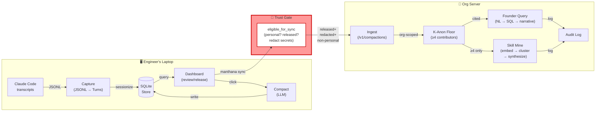

# Manthana: Local-First Visibility & Reuse for AI-Augmented Engineering

**Manthana captures every AI coding interaction, turns it into reusable team skills, and gives founders grounded, cited visibility — under an unbreakable trust contract where the employee owns the local store.**

---

## What is Manthana?

Manthana is an open-source, dual-licensed platform that closes the loop on AI-augmented engineering. It has two sides:

1. **Employee agent** (Apache-2.0): Runs locally on each engineer's machine. Continuously captures Claude Code transcripts, auto-compacts them into typed summaries, and lets the engineer see/act on their own work.
2. **Org server** (AGPL-3.0): Self-hosted by the founder or team. Ingests only what employees explicitly release, k-anonymizes it, and surfaces grounded, cited answers to founder questions and cross-engineer skill patterns.

Between them sits a **trust contract** — the single chokepoint that guarantees personal work never syncs and all egress is redacted.

## The Problem Manthana Solves

AI coding is prolific but opaque:

- **For engineers:** "What did I work on last week?" requires scanning a terminal history or Claude.com chat. How much did it cost? Where did I waste time?
- **For founders:** "Where is the team getting stuck?" and "What patterns could we turn into reusable skills?" are invisible. You can't cite claims about your engineering velocity or quality.

Today's alternatives:
- Manual dashboards (require discipline, easy to forget).
- Centralized logging (employees distrust them; secrets leak).
- Third-party APIs (vendor lock-in; GDPR/privacy hazards).

Manthana is different: **capture exhaust, not behavior**, and do it locally first.

## The Mission (Ask + Proactively Act)

**For engineers:**
- **Ask & Insights** — local, zero-cost queries over their own work ("what did I do last week?", "projects by outcome", token-usage rollups) with grounded, cited answers.
- **Optimize** — direct headroom integration for token-efficient Claude Code runs (context compression + persistent learned tuning).
- **Capture + Review** — one-click dashboards to review compactions, toggle Work/Personal, release to the org, and see mined skills from your own practice.

**For founders:**
- **Founder Query** — natural-language search that parses to structured filters, runs SQL over released compactions, and returns grounded narratives with citations (or "insufficient data" if k-anonymity fails — never hallucination).
- **Cross-Engineer Skill Mining** — surfaced skills mined from ≥4 distinct contributors so they're abstract, not person-specific. Auto-drafted, ready for team approval.
- **Weekly Digests + Trend Analytics** — org-level snapshots of cost, outcomes, friction, and emerging challenges.

Both sides stay **lightweight and proactive**: the daemon runs in the background, dashboards require one click, and real answers always cite their source.

---

## The Two Sides: How Data Flows

### The Employee Laptop (Local-First)

```
Claude Code transcript
       ↓
  [Capture]  ~/.claude/projects/*.jsonl → ingest_all
       ↓
  [Normalize] JSONL → Turn/Session (sessionize: >30min gap or >6h cap)
       ↓
  [Store]  SQLite @ ~/.manthana/manthana.db (Turns + Sessions)
       ↓
  [Compact] claude -p + LLM → EngineeringCompaction (typed summary)
       ↓
  [Review] Dashboard: work/personal toggle, release flag, local insights
```

Key principles:
- **Employee owns it all.** The SQLite store lives on the laptop; no automatic upload.
- **Cheap queries.** Insights (projects, outcomes, cost) run in-process; no LLM cost.
- **Deliberate compaction.** The engineer clicks "Compact" — this costs tokens; it's not auto-run.
- **Personal mode stays local.** If a session is marked Personal, it never syncs (enforced by test from day one).

---

### The Trust Gate: Released + Redacted + K-Anonymized

Before any data leaves the laptop:

```
Compaction (engine-side, full fidelity)
       ↓
 [Released?]  `released: bool` flag → review-before-sync inbox
       ↓
 [Redacted]  Redactor.redact_compaction:
             - Strip secrets (API keys, credentials, custom patterns)
             - Strip PII (emails, phone numbers, user data)
             - Keep structure (dates, counts, file counts)
       ↓
  [Synced]  manthana sync → POST to /v1/compactions
             (included only: released + redacted + non-personal)
```

**The single chokepoint:** `manthana.agent.sync.eligible_for_sync` — all egress passes through it.
- Personal-mode sessions: hard block (never check the `released` flag).
- Personal-mode sessions are also excluded from all dispatcher actions.
- Redaction-on-release: the local store keeps full fidelity; redaction applies only on the sync path.
- Tested end-to-end from commit one (`tests/test_personal_mode_invariant.py`).

---

### The Org Server (Founder Side)

```
Released + redacted compactions (inbound via agent sync)
       ↓
  [Ingest]  `/v1/compactions` POST (agent token) → ServerStore
             - actor = claims.actor (bind to token, no spoofing)
             - org/team scoped (JWT claim)
       ↓
  [K-Anon Gate]  Distinct contributors < k_anon_floor (default 4)?
                 → suppress aggregate / roll up to "insufficient data"
       ↓
 [Founder Query]  NL input → LLM parse → structured filter (team, project, outcome, actor, date range)
                            → SQL over k-anon-surviving compactions
                            → grounded narrative (cites compaction IDs)
                            → "insufficient data" if ungrounded or sub-floor
       ↓
 [Skill Mining]   embed(compaction text) → cluster → synthesize (LLM)
                  → validate / render SKILL.md (name, description, procedure)
                  → k-anon gate (≥4 contributors, names dropped)
                  → enqueue for approval
```

Key properties:
- **Org-scoped everywhere.** Every row, every query, every narrative is org-scoped.
- **Grounding is non-optional.** A narrative that can't cite its sources is withheld (never hallucinated).
- **K-anonymity is per-bucket.** A global floor applies; per-project, per-outcome sub-buckets below the floor are also suppressed.
- **Raw-transcript release is explicit.** If the engineer uploads the raw JSONL to the object store (MinIO/S3), only the founder can download it — and the audit log records the access.

---

## The Trust Contract (In Plain Language)

**For the employee:**
> You own your local store. Nothing leaves your machine without your consent. The "released" checkbox is your gate. If you mark a session Personal, it will never sync, period — and we test this end-to-end. We redact secrets and PII on the way out so you're not exposing credentials even if you forget. You can query your own work for free (no LLM calls unless you click Compact). You can see the founder's queries (audit log), and you can revoke consent for any action we propose.

**For the founder:**
> You see only released compactions, and you see them redacted. You don't see secrets, PII, or personal work. Cross-engineer aggregates show only what ≥4 people have released. If you ask a question we can't ground in your data, we tell you so instead of making something up. You never get a narrative that cites something outside your k-anon floor. Every query you run is logged so you can audit what you asked.

**For the engineer recruiting team:**
> This is a trust machine. The invariant that personal-mode never syncs is tested, not just claimed. Redaction patterns are vendored from ECC (battle-tested), and all code is open. The whole system fails closed: if the redactor can't decide, data doesn't leave. There's no hidden telemetry, no behavioral tracking, and no vendor API — just local capture, explicit release, and self-hosted sync.

---

## High-Level Architecture Diagram



---

## Deployment at a Glance

**For the engineer:**
```bash
manthana login --server https://manthana.acme.com --token <JWT>
manthana service install      # runs `manthana watch` at login
# That's it. Uses the dashboard daily.
```

**For the admin:**
```bash
docker compose up -d                    # server + Postgres + MinIO
docker compose exec server manthana-server onboard acme "Acme" platform "Platform" bob@acme.com
# → prints bob's token; hand to bob for manthana login
```

Full guides: [docs/deploy.md](../docs/deploy.md) (admin), [docs/onboarding.md](../docs/onboarding.md) (employee).

---

## What's Built (v1, as of 2026-06-20)

- ✅ **Schemas** (Pydantic v2): `Turn`, `Session`, `BaseCompaction`, `EngineeringCompaction`, `FrictionPoint`, `Action`, consent, audit.
- ✅ **Local store** (SQLite + SQLModel): CRUD, versioned migrations, index + JSON-document pattern.
- ✅ **Capture** (Claude Code): JSONL parse, sessionization, project/actor inference, verified on 425 real sessions.
- ✅ **Redaction** (verbatim ECC patterns + PII): configured via `manthana.toml`, piped to sync gate.
- ✅ **Work/Personal mode**: toggle in dashboard, wired to the sync gate, tested end-to-end.
- ✅ **Compaction** (LLM CLI shelling): cost tracking, defensive JSON parsing, EngineeringCompaction assembly.
- ✅ **Dashboard** (FastAPI + HTMX): sessions, compactions, skills, cost, actions; non-blocking async compaction.
- ✅ **Action dispatcher** (seam): personal-exclusion, consent, cooldown, audit log; auto-tag action shipped.
- ✅ **Server** (FastAPI + Postgres/SQLite): multi-tenancy, JWT auth, ingestion, raw-transcript release, k-anonymity.
- ✅ **Founder query**: structured-filter-first (NL → LLM parse → SQL → k-anon → grounded narrative).
- ✅ **Skill miner**: embed/cluster/synthesize/validate, SKILL.md rendering, provenance (content-hash versioning).
- ✅ **Agent→server sync**: SyncClient, redaction-on-release, idempotent sync-state, raw-transcript upload.
- ✅ **Founder console** (`/ui`): login, org dashboard, query form, skill-mine queue, audit log.
- ✅ **Auto-capture daemon** (`manthana watch`): incremental file polling, sessionization, auto-sync (released only).
- ✅ **Engineer insights** (Ask & Insights): local, grounded, cited answers; token-free rollups.
- ✅ **Optimize** (headroom integration): context compression + tuning; optional extra.
- ✅ **Real founder-narrative provider**: Anthropic API (optional; graceful degradation in dev/tests).

**196 tests green.** Multi-agent adversarial reviews (11→10+ confirmed issues per pass) hardened every critical path; all fixed with regression tests. Verified live on real data (425 sessions, 28k+ turns).

---

## Licensing & Attribution

- **Server** (`manthana-server`): **AGPL-3.0** (copyleft, triggers on source-code distribution).
- **Agent, collectors, schemas** (`manthana`, `manthana-collectors`, `manthana-schemas`): **Apache-2.0** (permissive).
- **Portions derived from ECC** (Affaan Mustafa, MIT): secret patterns, cost rates, agent-data-home pattern, session-end line handling. Full attribution in [`NOTICE`](../NOTICE) and [`LICENSES/MIT-ECC.txt`](../LICENSES/MIT-ECC.txt).

**Repository:** [github.com/Suraj-gameramp/manthana](https://github.com/Suraj-gameramp/manthana) (public, MIT-licensed examples welcome).

---

## Next Pillars (Beyond v1)

- **Remaining v1.5 actions**: loop-detection warnings, prior-work surface, team digests.
- **Skill mining at scale** (pgvector): cross-org, cross-team clustering with k-anonymity.
- **Resume-thread stitching**: connect work across sessions/projects over time.
- **IDE integration** (Cursor first): capture from IDEs, not just Claude Code.
- **Fine-tuned models** (v2): org-specific models trained on org skills + patterns.

---

## For More Details

- **Spec & decisions:** [spec/manthana-decisions.md](../spec/manthana-decisions.md) (locked decisions for v1).
- **Realized architecture:** [spec/manthana-architecture.md](../spec/manthana-architecture.md) (code-level mapping, all phases, review hardening).
- **Deployment:** [docs/deploy.md](../docs/deploy.md) and [docs/onboarding.md](../docs/onboarding.md).
- **Code:** `schemas/`, `collectors/`, `agent/`, `server/`, `skills/`, `tests/`.
