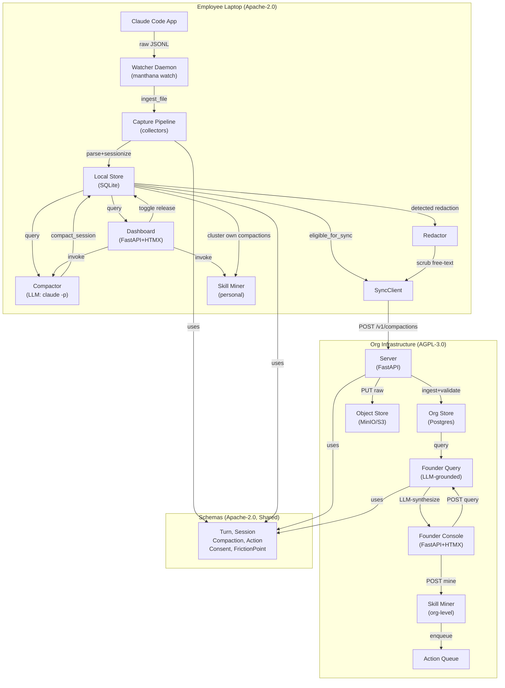

# System Architecture

Manthana is an open-source, local-first platform that captures AI coding interactions, compacts them into typed artifacts, enforces strict privacy boundaries, and surfaces grounded insights. This document maps the five package distributions, the runtime components (local agent + employee dashboard; org server + founder console), and the core data flow.

---

## 1. Distributions & Licensing

Manthana ships as a `uv` workspace with five distributions under the PEP 420 namespace `manthana`, each with its own `pyproject.toml` and licensing:

```
Repository Root: /Users/suraj/Desktop/project/
├── schemas/              → manthana-schemas (Apache-2.0)
├── collectors/           → manthana-collectors (Apache-2.0)
├── skills/              → manthana-skills (Apache-2.0)
├── agent/               → manthana (Apache-2.0)
├── server/              → manthana-server (AGPL-3.0)
```

**Package interdependencies:**
- `manthana-schemas` (Pydantic v2 + JSON Schema): no dependencies on other distributions.
- `manthana-collectors`: depends on `manthana-schemas` (for `Turn`, `Session` contracts).
- `manthana-skills`: depends on `manthana-schemas` (for `BaseCompaction` contract).
- `manthana` (the agent): depends on `manthana-schemas`, `manthana-collectors`, `manthana-skills`.
- `manthana-server`: depends on `manthana-schemas`, `manthana-skills`.

**Installation:**
- `pip install manthana` → pulls agent + CLI (dependencies auto-include schemas and collectors).
- `pip install manthana-server` → org installs separately (AGPL boundary enforced by distinct distribution).

**Licensing note:** The namespace merge (PEP 420, no `src/manthana/__init__.py`) is intentional — the Apache client and AGPL server coexist peacefully under one namespace without a shared root `__init__.py`.

---

## 2. The Local Agent (Employee Side)

The local agent runs entirely on the engineer's machine. It captures transcripts, stores them locally, compacts them, and syncs released compactions to the org server through a single egress chokepoint.

### 2.1 Local Store (SQLite)

**Location:** `$MANTHANA_DATA_HOME/manthana.db` (default: `~/.manthana/manthana.db`)

**Component:** `manthana.agent.store`

Modules:
- `datahome.py`: resolve and create `$MANTHANA_DATA_HOME` (respects env override, falls back to `~/.manthana`).
- `engine.py`: SQLite engine (or PostgreSQL in a future variant), pragmas (WAL, busy timeout), optional sqlite-vec.
- `tables.py`: SQLModel table definitions (see §2.1a).
- `migrations.py`: versioned schema migrations (idempotent).
- `store.py`: `Store` CRUD API for sessions, turns, compactions, action audit, consent, sync state.

**Schema (five tables + join tables):**

```
session:
  id (PK) | actor (idx) | surface (idx) | project (idx) | mode (idx)
  started_at (idx) | ended_at | resumed_from (idx) | turn_count
  data (JSON: full Session model)

turn:
  id (PK) | session_id (idx) | actor (idx) | seq (idx) | role (idx)
  timestamp | data (JSON: full Turn model)

compaction:
  id (PK) | session_id (idx) | actor (idx) | project (idx) | surface (idx)
  kind (idx: "base"|"engineering") | outcome (idx) | released (idx)
  started_at (idx) | tier_used | est_cost_usd
  data (JSON: full BaseCompaction or EngineeringCompaction)

action_audit:
  id (PK) | action_id (idx) | actor (idx) | fired_at (idx) | outcome (idx)
  data (JSON: full ActionAuditEntry)

consent:
  id (PK) | subject (idx) | action_category (idx) | state (idx)
  data (JSON: full ConsentEntry)

sync_state:
  id (PK) | compaction_id (idx) | synced_at | raw_synced_at
```

**Design: document-store-with-indexes** — index columns enable fast queries; the authoritative model lives in the `data` JSON column. Validation happens at the contract layer (schemas/); the store reconstructs objects via `CompactionAdapter.validate_python(row.data)`.

### 2.2 Capture Pipeline

**Component:** `manthana.collectors` + `manthana.agent.capture`

Modules:
- `collectors/base.py`: `Collector` protocol (abstract interface).
- `collectors/claude_code.py`: reads `~/.claude/projects/*/*.jsonl` (Claude Code CLI transcripts); parses raw JSON lines into `Turn` objects; handles tool-pairing via `tool_use_id`; normalizes token counts.
- `collectors/sessionize.py`: boundary inference — splits turns into `Session` objects on >30min gap, >6h cap, or explicit stop signal; chains resumed sessions via `resumed_from`.
- `collectors/identity.py`: resolve engineer actor (from `$MANTHANA_ACTOR`, git email, or OS user).
- `collectors/project.py`: infer project name (`git rev-parse --show-toplevel` or cwd basename).
- `collectors/codex.py`: stub (Codex JSONL format not yet verified on current Codex; registered but non-functional in v1).

**Flow:** `ingest_file(path) → ClaudeCodeCollector.read(path) → sessionize → [infer_project, resolve_actor] → Store.upsert_session + add_turns`

**Grounding:** 425 sessions, 28,622 turns from real machine data; end-to-end tested on actual `~/.claude/projects/`.

### 2.3 Redaction & Work/Personal Mode

**Component:** `manthana.agent.redaction`

Modules:
- `patterns.py`: `SECRET_PATTERNS`, `APPROVAL_COMMANDS`, `SENSITIVE_PATHS` — verbatim copies from ECC's `governance-capture.js` (MIT, Affaan Mustafa; attributed in `NOTICE`). Plus Manthana's own `PII_PATTERNS` (email, phone).
- `redactor.py`: `Redactor` class; methods: `detect()`, `redact_text()`, `redact_turn()`, `redact_turns()`, `redact_compaction()`. Redaction returns **copies**; the local store keeps full fidelity.

**Config:** optional `$MANTHANA_DATA_HOME/manthana.toml` (`[redaction]`, `[embeddings]` sections); CLI commands `manthana mode <session_id> work|personal`.

**Trust contract enforcement:** `eligible_for_sync(store)` in `manthana.agent.sync` is the single egress chokepoint. Personal-mode sessions never sync. Guarded by `tests/test_personal_mode_invariant.py` from commit one.

### 2.4 Compaction & Cost Estimation

**Component:** `manthana.agent.compactor` + `manthana.agent.cost`

Modules:
- `llm/provider.py`: `LLMProvider` protocol; implementations: `ClaudeCLIProvider` (shells to `claude -p --output-format json`), `CodexCLIProvider`, `MockProvider` (for tests).
- `cost/rates.py`: `RATE_TABLE` — verbatim from ECC's `cost-tracker.js` (token prices per model tier). `estimate_cost(turns) → CostBreakdown` (tokens + USD).
- `compactor/prompt.py`: serializes turns to compact JSON; fixed template asking for an `EngineeringCompaction` response.
- `compactor/compactor.py`: `Compactor.compact(session, turns) → EngineeringCompaction`. Defensively parses LLM JSON; falls back on malformed output. Deterministic fields (ids, cost, duration) always from Manthana, never from LLM.
- `compact.py`: `compact_session(id)` / `compact_pending()` (skips personal-mode).

**v1 design:** uses the engineer's own model access (`claude -p` / `codex exec`); Manthana ships no API key.

### 2.5 Dashboard & Local Query

**Component:** `manthana.agent.dashboard`

Module: `dashboard/app.py` — FastAPI + HTMX, no build step.

**Pages & routes:**
- `GET /` — Sessions list (work/personal toggle, tag labels), sessions count, cost.
- `GET /compactions` — Review-before-sync inbox (compaction detail, release toggle).
- `GET /skills` — SKILL.md viewer (reads `~/.claude/skills/personal/`).
- `GET /cost` — per-session + total cost breakdown.
- `GET /actions` — action audit log.

**Actions (POST → 303 redirect):**
- `POST /capture` → `ingest_all()`
- `POST /session/{id}/compact` → daemon thread running `compact_session()` (non-blocking, shows ⏳ compacting…)
- `POST /compaction/{id}/release` → toggle `released` flag
- `POST /skills/mine` → `mine_personal()`, write proposals
- `POST /sync` → `SyncClient.sync()` (if configured)

**Local query endpoints (engineer Ask & Insights):**
- `/insights` — no-LLM structural rollups (cost, projects, outcomes, turn counts, duration).
- `/ask?q=...` — grounded, cited answers over own compactions (uses engineer's model).

**Design:** single-employee, localhost-only, no auth. Values HTML-escaped; path params are parameterized lookups.

### 2.6 Auto-Capture Daemon

**Component:** `manthana.agent.watcher`

Module: `watcher.py` — `watch(store, ...)` polls `~/.claude/projects` and ingests new/changed transcripts automatically.

**Design:**
- Tracks `{path: mtime}` from `ClaudeCodeCollector.discover()`.
- Calls `ingest_file` only for new/changed files (incremental + idempotent).
- First cycle catches everything; then runs incrementally.
- `compact=True` runs `compact_pending()` after each change (optional; capture-only by default).
- Per-file errors logged + retried; vanished files forgotten (re-ingest on recreate).

**CLI:** `manthana watch --interval 30 --compact`

---

## 3. Org Server (Founder Side)

The org-side server is a separate AGPL distribution. It ingests released, redacted compactions from agents; stores them in Postgres; applies k-anonymity floors; and surfaces grounded founder narratives.

### 3.1 Server Store (Postgres + S3/MinIO)

**Component:** `manthana.server`

Location: Postgres (dev: SQLite), MinIO/S3 for raw transcript release.

Modules:
- `config.py`: `ServerConfig` from `MANTHANA_SERVER_*` env vars (DB URL, JWT secret, admin token, k-anon floor, object store config).
- `db.py`: engine (SQLite or Postgres), `init_db()`.
- `tables.py`: multi-tenant SQLModel tables (see §3.1a).
- `storage.py`: `ObjectStore` protocol; `InMemoryObjectStore` (dev), `S3ObjectStore` (prod: MinIO/S3/GCS/R2).
- `auth.py`: JWT team-scoped tokens (`issue_team_token`, `verify_team_token`); static admin token.
- `store.py`: `ServerStore` — tenancy CRUD, `ingest_compaction()`, `query_compactions()`, `record_raw()`, consent.

**Schema (seven tables):**

```
org:
  id (PK) | name | created_at

team:
  id (PK) | org_id (idx) | name

actor:
  id (PK, org email) | org_id (idx) | team_id (idx) | display_name

released_compaction:
  id (PK: org::uuid) | org_id (idx) | team_id (idx) | actor (idx)
  project (idx) | surface (idx) | outcome (idx) | started_at (idx)
  kind (idx) | released (idx) | tier_used | est_cost_usd
  data (JSON: full CompactionAdapter-deserialized model)

raw_transcript:
  id (PK) | compaction_id (idx) | org_id (idx) | object_key | uploaded_at

action_queue:
  id (PK) | action_id (idx) | org_id (idx) | team_id (idx, nullable)
  status (idx) | created_at
  data (JSON: pending action, e.g. mined skill proposal)

org_consent:
  id (PK) | org_id (idx) | subject (idx) | action_category (idx) | state (idx)
  data (JSON: full ConsentEntry)

founder_query_audit:
  id (PK) | org_id (idx) | query | insufficient (idx) | citation_count | created_at
```

**Design:** same document-store-with-indexes pattern. Multi-tenancy enforced: every row carries `org_id`; founder queries are org-scoped; cross-tenant read/write is impossible (checked in `get_owned_compaction`).

### 3.2 Ingestion & Sync Boundary

**Component:** `manthana.agent.sync_client` → `manthana.server.app` (`POST /v1/compactions`)

**Local egress (agent):**

Module: `agent/src/manthana/agent/sync_client.py` — `SyncClient.sync(store)`:
1. Reads sync-eligible compactions via `eligible_for_sync()` (personal excluded, released-only, fail-closed).
2. Skips ids already in `sync_state` table (idempotent).
3. **Redacts** each compaction (free text scrubbed; secrets/PII never cross).
4. POSTs batch to `POST /v1/compactions` with team JWT.
5. Optionally uploads raw transcripts (redacted turns as JSONL) to `POST /v1/compactions/{id}/raw`.
6. Records `mark_synced` in local `sync_state` table.

**Server ingestion:**

Module: `server/src/manthana/server/app.py`:
- `POST /v1/compactions` (team JWT) — `ingest_compaction()`: validates release status; org/team from token; upserts actor; stores in `released_compaction` table.
- `POST /v1/compactions/{id}/raw` (team JWT) — uploads raw JSONL to object store; tracks in `raw_transcript` table.

**Trust contract:** personal/unreleased compactions never sync; re-sync idempotent; secrets redacted before egress.

### 3.3 Founder Narrative (Structured Query → SQL → Grounded Narrative)

**Component:** `manthana.server.founder`

Module: `founder.py` — three-step pipeline:

**Step 1: Parse NL to FounderFilter**
- LLM parses natural-language query to a structured filter: `{team?, time_range?, project?, outcome?, actor?, surface?}`.
- On provider error: empty filter (match all).

**Step 2: SQL Query + K-Anonymity**
- Run SQL over `released_compaction` table, org-scoped, matching filter.
- Apply k-anonymity floor (default 4): distinct contributors < floor ⇒ suppress.
- Per-project/per-outcome sub-buckets also checked.

**Step 3: Grounded Narrative**
- LLM synthesizes a narrative grounded in the query result.
- **Every claim must cite a compaction id** — non-optional grounding.
- Queries that cannot be grounded return "insufficient data" (no hallucination).
- On provider error: "insufficient data" (graceful degradation).

**Integration:** `manthana.server.app` exposes `/v1/founder/query` (admin); founder console mounts at `/ui/query`.

### 3.4 Skill Miner (Cross-Engineer Pattern Mining)

**Component:** `manthana.skills` (shared Apache package) + server action queue

Modules:
- `embed.py`: `Embedder` protocol; `HashingEmbedder` (deterministic, default), `SentenceTransformerEmbedder` (optional bge-large).
- `cluster.py`: greedy community detection (cosine threshold 0.75); ≥N-contributor/session recurrence gate (post-hoc).
- `skillmd.py`: validated SKILL.md format (name ≤64, no reserved words; description ≤1024, no XML).
- `synthesize.py`: LLM synthesis with validate/repair; deterministic fallback (never crashes).
- `provenance.py`: versioned record (source, created_at, confidence) + evidence trail (compaction ids), content-hash (`sha256:`).
- `miner.py`: orchestrates; `mine_personal()` (≥3 sessions), `mine_org()` (≥4 contributors, names dropped, k-anon).

**Integration (server):**
- `POST /v1/admin/mine-skills {org_id}` (admin) — runs `mine_org()` over org's released compactions, enqueues proposals in `action_queue` for approval.
- Verified end-to-end: 5 contributors → 1 queued skill.

---

## 4. Component Interaction Diagram (C4-ish)



---

## 5. Data Flow: Capture to Founder Insight

**Vertical slice (v1 complete):**

```
1. Capture:
   ~/.claude/projects/*.jsonl
   ↓
   ClaudeCodeCollector.read()
   ↓
   sessionize (>30min gap, >6h cap)
   ↓
   infer_project, resolve_actor
   ↓
   Store.upsert_session + add_turns
   
2. Redaction:
   LocalStore + Session → Redactor.detect()
   ↓
   User marks work/personal (or auto-defaults to work)
   ↓
   personal-mode sessions blocked at sync chokepoint
   
3. Compaction (optional):
   Dashboard: POST /session/{id}/compact
   ↓
   Compactor.compact() via `claude -p`
   ↓
   cost_estimate()
   ↓
   Store.upsert_compaction
   ↓
   Dashboard: POST /compaction/{id}/release
   ↓
   released = true
   
4. Sync (opt-in):
   Dashboard: POST /sync (or manthana sync CLI)
   ↓
   eligible_for_sync(store)
   ├─ personal? → blocked (hard invariant)
   ├─ released? → yes
   └─ → allowed
   ↓
   Redactor.redact_compaction()
   ↓
   POST /v1/compactions + JWT
   ↓
   Server.ingest_compaction()
   ├─ org/team from JWT
   ├─ release-check (must be released=true)
   └─ upsert released_compaction table
   
5. Founder Query:
   FounderUI: POST /ui/query "What did my team ship?"
   ↓
   founder.run_query()
   ├─ parse NL → FounderFilter (LLM)
   ├─ SQL: SELECT compactions WHERE org_id=X AND filter matches
   ├─ k-anon: contributors < 4? → "insufficient data"
   └─ narrative (LLM): grounded in compaction ids or "insufficient"
   ↓
   Render narrative + citations
```

---

## 6. Packaging & Installation

### 6.1 Distribution Artifacts

**PyPI packages (named):**
- `manthana-schemas` (v0.2.0, Apache-2.0) — Pydantic + JSON Schema.
- `manthana-collectors` (v0.2.0, Apache-2.0) — collector protocols + implementations.
- `manthana-skills` (v0.2.0, Apache-2.0) — skill miner (shared by agent + server).
- `manthana` (v0.2.0, Apache-2.0) — local agent + CLI.
- `manthana-server` (v0.2.0, AGPL-3.0) — org server + founder console.

**Optional extras:**
- `manthana[vec]` — local vector store (sqlite-vec).
- `manthana[embeddings]` — semantic embeddings (sentence-transformers, heavy).
- `manthana[optimize]` — headroom context-compression (headroom-ai).
- `manthana-server[postgres]` — Postgres driver (psycopg + pgvector).
- `manthana-server[s3]` — S3 support (boto3).
- `manthana-server[llm]` — real founder narratives (anthropic SDK).

### 6.2 Local Development

```bash
# Install + wire up all packages editable
uv sync --all-packages

# Lint + type + test
uv run ruff check .
uv run pyright
uv run pytest

# Regenerate JSON Schema mirror
uv run manthana-schemas-export
```

### 6.3 Deployment

**Local agent (employee):**
```bash
pip install manthana
manthana login                    # provision auth
manthana service install          # launchd/systemd
manthana dashboard               # http://127.0.0.1:8765
```

**Org server (admin):**
```bash
pip install manthana-server[postgres]
docker compose up                # Postgres + MinIO (or bring your own DB + S3)
manthana-server create-org acme
manthana-server create-team acme engineering
manthana-server token acme engineering  # issue JWT for agents
# Visit http://localhost:8000/ui (sign in with admin token)
```

---

## 7. Key Design Decisions

### 7.1 Local-First, Trust Contract

- **Employee owns the local store.** The org sees only released + redacted + k-anonymized data.
- **Personal-mode never syncs.** Enforced by `eligible_for_sync()` gate, guarded by `tests/test_personal_mode_invariant.py` from commit one.
- **Single egress chokepoint:** `manthana.agent.sync.eligible_for_sync`. All data leaving the laptop must pass through it.

### 7.2 PEP 420 Namespace

- No `src/manthana/__init__.py` in any package. The namespace merges across separately-installed distributions.
- Keeps AGPL server (manthana-server) and Apache client (manthana) distinct in packaging + licensing while sharing schemas + skills via the merged namespace.

### 7.3 Document-Store-with-Indexes

- Index columns enable fast queries (actor, project, outcome, dates).
- Authoritative model lives in JSON `data` column; reconstructed via `CompactionAdapter.validate_python(row.data)`.
- Avoids schema drift: validation is a contract concern, not a persistence concern.
- Enables compaction polymorphism (`BaseCompaction` ← `EngineeringCompaction`) trivially.

### 7.4 Multi-Tenancy: Org > Team > Actor

- Org (e.g., Acme Inc.)
  - Team (e.g., Engineering)
    - Actor (engineer, identified by org email)
      - Project (tagged cross-cutting)

- JWT team-scoped token: agent authenticates with `{actor, org, team, exp}`.
- Server enforces org-scoped ingestion + queries.

### 7.5 K-Anonymity Floor = 4 (Configurable)

- No team-level aggregate produced where contributor count < 4.
- Sub-buckets (per-project, per-outcome) also checked.
- Queries that fall below floor return "insufficient data" (no data disclosure).

### 7.6 No Bundled API Key

- Local compactor shells to `claude -p` or `codex exec` — uses engineer's own model access.
- Server narrative provider is injected (`LLMProvider` protocol); dev uses mock; production provisions org's own key.
- Zero hidden cost; inherits engineer's tier/quota.

---

## 8. Testing & Quality Assurance

**Test footprint:** 131 tests across `tests/` (cross-package).

**Key test files:**
- `test_personal_mode_invariant.py` — guards the trust contract (personal never syncs); from commit one.
- `test_schema_roundtrip.py` — Pydantic ↔ JSON Schema consistency.
- `test_sync.py` — capture → compact → release → sync → ingest → query roundtrip.
- `test_server.py` — auth, ingestion, raw release, k-anon suppression, grounded narrative.
- `test_dashboard.py` — local query, capture, compact, release, skill mine actions.
- `test_skillminer.py` — embed, cluster, synthesize, provenance, k-anon.

**Adversarial reviews (completed):**
- Local agent (vertical slice): 4 reviewers, 11 confirmed issues, all fixed + regression tests.
- Server (core + founder query): 3 reviewers, 11 confirmed issues, all fixed + regression tests.
- Sync egress (agent → server): 2 reviewers, 5 confirmed issues, all fixed.
- Skill miner: 2 reviewers, 10 confirmed issues, all fixed.
- Founder UI + async compaction: 4 dimensions, 10 confirmed issues, all fixed.
- LLM provider: 23 raw → 13 confirmed, graceful degradation + citation-matching fixes.

---

## 9. File Paths (Key Modules)

### Schemas (`manthana.schemas`)
- `schemas/src/manthana/schemas/turn.py` — Turn (session line), flattening rules (user/assistant/tool_use/tool_result).
- `schemas/src/manthana/schemas/session.py` — Session (boundary-inferred group of turns).
- `schemas/src/manthana/schemas/compaction.py` — BaseCompaction, EngineeringCompaction (typed work summary).
- `schemas/src/manthana/schemas/friction.py` — FrictionPoint (loop/tool_error/abandon/retry/deadend).
- `schemas/src/manthana/schemas/action.py` — Action, ActionAuditEntry, ActionQueueItem.
- `schemas/src/manthana/schemas/consent.py` — ConsentEntry (opt-in/opt-out state).
- `schemas/src/manthana/schemas/enums.py` — StrEnums for controlled vocab (Role, Surface, Mode, Outcome, etc.).
- `schemas/src/manthana/schemas/export.py` — JSON Schema mirror exporter.

### Collectors (`manthana.collectors`)
- `collectors/src/manthana/collectors/base.py` — Collector protocol.
- `collectors/src/manthana/collectors/claude_code.py` — Claude Code JSONL parser.
- `collectors/src/manthana/collectors/sessionize.py` — Boundary inference.
- `collectors/src/manthana/collectors/project.py` — Project inference.
- `collectors/src/manthana/collectors/identity.py` — Actor resolution.

### Agent (`manthana.agent`)
- `agent/src/manthana/agent/datahome.py` — $MANTHANA_DATA_HOME resolution.
- `agent/src/manthana/agent/store/` — Local SQLite store (tables.py, engine.py, migrations.py, store.py).
- `agent/src/manthana/agent/capture.py` — ingest_file / ingest_all.
- `agent/src/manthana/agent/redaction/` — Redactor, patterns, config.
- `agent/src/manthana/agent/compactor/` — Compactor, prompt, cost estimation.
- `agent/src/manthana/agent/cost/` — cost.py, rates.py (RATE_TABLE verbatim from ECC).
- `agent/src/manthana/agent/dashboard/app.py` — FastAPI + HTMX local UI.
- `agent/src/manthana/agent/llm/provider.py` — LLMProvider protocol + implementations.
- `agent/src/manthana/agent/actions/` — dispatcher.py, auto_tag.py, base.py.
- `agent/src/manthana/agent/sync_client.py` — SyncClient (eligible_for_sync → redact → POST).
- `agent/src/manthana/agent/sync.py` — Sync eligibility gate.
- `agent/src/manthana/agent/watcher.py` — Auto-capture daemon.
- `agent/src/manthana/agent/skillminer.py` — Thin wrapper for personal skill mining.
- `agent/src/manthana/agent/insights.py` — Engineer Ask & Insights.
- `agent/src/manthana/agent/optimize.py` — Headroom integration.
- `agent/src/manthana/agent/cli.py` — typer CLI (manthana capture, sessions, mode, compact, watch, dashboard, ask, mine-skills, sync, etc.).

### Skills (`manthana.skills`)
- `skills/src/manthana/skills/embed.py` — Embedder protocol + HashingEmbedder, SentenceTransformerEmbedder.
- `skills/src/manthana/skills/cluster.py` — Greedy community detection.
- `skills/src/manthana/skills/skillmd.py` — SKILL.md validation + rendering.
- `skills/src/manthana/skills/synthesize.py` — LLM synthesis + fallback.
- `skills/src/manthana/skills/provenance.py` — Versioned provenance + content hash.
- `skills/src/manthana/skills/miner.py` — SkillMiner orchestration.
- `skills/src/manthana/skills/provider.py` — Injected LLMProvider + Redaction protocols.

### Server (`manthana.server`)
- `server/src/manthana/server/config.py` — ServerConfig from env.
- `server/src/manthana/server/db.py` — SQLite/Postgres engine.
- `server/src/manthana/server/tables.py` — Multi-tenant SQLModel tables.
- `server/src/manthana/server/auth.py` — JWT team tokens + admin token.
- `server/src/manthana/server/store.py` — ServerStore CRUD.
- `server/src/manthana/server/storage.py` — ObjectStore (InMemory, S3, MinIO, GCS, R2).
- `server/src/manthana/server/founder.py` — Structured query → SQL → k-anon → grounded narrative.
- `server/src/manthana/server/llm.py` — AnthropicProvider (real) + MockProvider.
- `server/src/manthana/server/app.py` — FastAPI routes (/v1/compactions, /v1/founder/query, /healthz, admin endpoints).
- `server/src/manthana/server/ui.py` — Founder console (GET /ui, POST /ui/query, POST /ui/mine, /ui/login, /ui/logout).
- `server/src/manthana/server/cli.py` — typer CLI (manthana-server serve, create-org, create-team, token).

### Tests
- `tests/test_personal_mode_invariant.py` — Trust contract (no personal leak).
- `tests/test_schema_roundtrip.py` — Schema consistency.
- `tests/test_sync.py` — Full sync roundtrip.
- `tests/test_server.py` — Ingestion, k-anon, narrative.
- `tests/test_dashboard.py` — Dashboard actions.
- `tests/test_skillminer.py` — Skill mining pipeline.
- `tests/fixtures/` — Real data samples (compactions, skills, transcripts).

---

## 10. Configuration & Environment

### Agent
- `$MANTHANA_DATA_HOME` — local store root (default: `~/.manthana`).
- `$MANTHANA_ACTOR` — engineer email override (default: git email or OS user).
- `$MANTHANA_DATA_HOME/manthana.toml` — optional config ([redaction], [embeddings]).
- `$MANTHANA_SERVER_URL` — server URL for sync.
- `$MANTHANA_TEAM_TOKEN` — JWT for agent → server authentication.

### Server
- `MANTHANA_SERVER_DB_URL` — Postgres/SQLite connection string.
- `MANTHANA_SERVER_JWT_SECRET` — signing key for team tokens.
- `MANTHANA_SERVER_ADMIN_TOKEN` — static token for founder console + admin endpoints.
- `MANTHANA_SERVER_K_ANON_FLOOR` — k-anonymity minimum (default 4).
- `MANTHANA_SERVER_OBJECT_STORE` — `memory` (dev), `s3` (prod).
- `MANTHANA_SERVER_LLM` — `mock` (dev), `anthropic` (prod).
- `MANTHANA_SERVER_LLM_MODEL` — default `claude-sonnet-4-6`.
- `ANTHROPIC_API_KEY` — for real founder narratives.

---

## 11. Deployment Architecture

**Single-host reference deployment (docker-compose.yml):**

```yaml
services:
  postgres:
    image: pgvector/pgvector:pg17
    ports: [5433:5432]
    env: POSTGRES_DB=manthana, etc.
  
  minio:
    image: minio/minio:latest
    ports: [9000:9000, 9001:9001]
    env: MINIO_ROOT_USER/PASSWORD
  
  server:
    build: .
    ports: [8000:8000]
    depends_on: [postgres, minio]
    env: MANTHANA_SERVER_* (all required keys)
    command: manthana-server serve
```

**Kubernetes manifests (deploy/k8s/):**
- Deployment (non-root, readiness/liveness probes at /healthz, /readyz).
- Service (internal + optional ingress).
- ConfigMap (server config).
- Secret (JWT secret, admin token, API keys).

---

## 12. Trust & Compliance Checkpoint

| Layer | Control |
|---|---|
| **Capture** | Only Claude Code JSONL; optional Codex stub; no private channels. |
| **Local Storage** | SQLite on disk (employee-controlled path); no mandatory upload. |
| **Work/Personal** | Toggle on each session; personal-mode blocks sync (invariant tested). |
| **Redaction** | Secrets/PII scrubbed before release (verbatim ECC patterns + Manthana PII). |
| **Release Gate** | User explicitly toggles `released: true` in dashboard review (inbox model). |
| **Egress** | Single chokepoint `eligible_for_sync()` (personal excluded, release-gated, fail-closed). |
| **Server Ingestion** | JWT + org/team binding; release-check enforced (rejects unreleased). |
| **Founder Query** | org-scoped SQL; k-anon floor (≥4 contributors); grounded-or-withheld narrative. |
| **Audit** | Action audit log + founder query audit (v1.5 completed). |

---

## 13. Next Phases (Post-v1)

- **v1.5:** remaining 6 actions (auto-surface prior work, forgotten solutions, loop detection, founder digest, team digest, cost dashboard), daemon systemd/launchd packaging, server-side LLM provider real key provisioning.
- **v1.5 hardening:** per-filter k-anonymity check, server-side personal-mode reject, founder-query audit view.
- **v2:** IDE collector (Cursor first), web/Slack/Teams collector, skill-library web UI, multi-team federation, custom action authorship.

---

## 14. Referenced Documents

| Document | Purpose |
|---|---|
| `spec/manthana-architecture.md` | Detailed realized architecture (29 sections, file paths, decisions). |
| `spec/manthana-decisions.md` | Locked v1 decisions (identity, stack, trust contract, actions, open items). |
| `README.md` | User-facing overview + dev quickstart. |
| `docs/deploy.md` | Server deployment guide. |
| `docs/onboarding.md` | Employee onboarding (login, service install). |
| `NOTICE` | Attribution log (ECC + derivations). |
| `LICENSES/Apache-2.0.txt`, `LICENSES/AGPL-3.0.txt`, `LICENSES/MIT-ECC.txt` | Full license texts. |

---

**Version:** v0.2.0  
**Status:** v1 complete; vertical slice verified end-to-end (capture → store → compact → release → sync → ingest → founder query).  
**Tests:** 131 green; adversarial review hardened across 6 passes.  
**Public repo:** github.com/Suraj-gameramp/manthana
