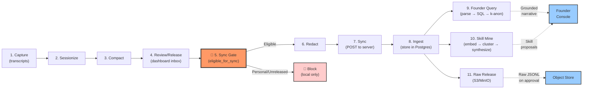

# Data Pipeline and Dataflow

End-to-end flow from transcript capture to founder intelligence and skill mining, with the trust gate at the center.

---

## Overview

The Manthana pipeline transforms raw AI coding transcripts into reusable team skills and grounded founder insights, under a strict trust contract. Data flows through eleven stages across two sides (employee local agent + org server), with a single chokepoint (`eligible_for_sync`) where the personal-mode invariant and release-gate are enforced.

---

## Pipeline Stages

### Stage 1: Capture

**Sources:** Claude Code transcripts (`~/.claude/projects/*.jsonl`); Codex registered as a stub (no verified local format).

**Entry points:**
- `manthana.collectors.ClaudeCodeCollector.read(path)` — parses one JSONL file into ordered `Turn` objects + metadata (`FileMeta`: cwd, git_branch, session_id, mtime, compact_summary).
- `manthana.collectors.ClaudeCodeCollector.discover()` — globs all accessible transcripts.
- `manthana.agent.capture.ingest_file(store, source)` — high-level wrapper; resolves actor and project.
- `manthana.agent.capture.ingest_all(store)` — discover and ingest every transcript.

**Output:** A list of `Turn` objects (flattened from nested JSON blocks: user text, assistant text, tool_use calls, tool_result blocks, paired by `tool_use_id`).

**Key detail:** Claude Code's own compaction summaries (`isCompactSummary` meta) are captured as `FileMeta.compact_summary` and flagged in the session for cheap re-use.

---

### Stage 2: Sessionize

**Function:** `manthana.collectors.sessionize(turns, …)` — splits a transcript's flat turn stream into logical sessions on boundaries.

**Boundary rules:**
- \> 30-minute gap between turns.
- \> 6-hour continuous duration (forced cap).
- Sessions are chained by `resumed_from: session_id` for continuity.

**Project & actor inference:**
- `manthana.collectors.infer_project(cwd)` — `git rev-parse --show-toplevel` with cwd-basename fallback.
- `manthana.collectors.resolve_actor()` — `$MANTHANA_ACTOR` → global git email → OS user.

**Output:** One or more `Session` objects per transcript, each with:
- Turn count, start/end times, mode (Work / Personal, defaults to Work).
- `source_path` (original transcript file), `resumed_from` (if chained).
- `has_compact_summary` flag for sessionize-time detection.

**Store:** `Store.upsert_session(session)` + `Store.add_turns(session_id, turns)` (now atomic in one transaction via `replace_session_family`).

---

### Stage 3: Compact

**High-level:** `manthana.agent.compact.compact_session(store, session_id)` and `compact_pending(store, limit=, summarized_only=)` — synthesizes a session into a typed `EngineeringCompaction`.

**Flow:**
1. Fetch the session and its turns from the store.
2. If the session has Claude's compaction summary (`has_compact_summary=True`), read it via `ClaudeCodeCollector.read_summary(source_path)` (cheap pre-filter).
3. Call `Compactor.compact(session, turns, claude_summary=)` to invoke the LLM:
   - Prompt template serializes turns (or summary + recent turns if available) as compact JSON.
   - LLM returns a JSON object.
   - Defensive parsing extracts the JSON (tolerates prose/fences).
   - Assemble the `EngineeringCompaction` with:
     - **Qualitative fields** from the LLM: `task_intent`, `approach`, `artifacts`, `friction_points`, `outcome`.
     - **Deterministic fields** (never from LLM): `id`, `session_id`, `actor`, `duration_seconds`, `tier_used`, `est_cost_usd` (computed from turns' tokens), `reusable_pattern` (heuristic).
   - Tag with `source` ("full" | "claude_summary") and `prompt_version`.
4. Store via `Store.upsert_compaction(compaction)`.

**CLI:** `manthana compact [session_id]` or `manthana watch --compact` (auto-compaction on new sessions).

**Cost estimation:** `manthana.agent.cost.estimate_cost(turns)` sums token usage and applies verbatim ECC `RATE_TABLE` (copy). Default tier is `sonnet`.

**LLM provider abstraction:** `manthana.agent.llm.LLMProvider` (protocol) with implementations for Claude (via `claude -p` CLI), Codex (via `codex exec` CLI), and Mock (deterministic, for CI).

---

### Stage 4: Review / Release

**Dashboard inbox:** `GET /` sessions page → one-click Work/Personal toggle + View/Edit tags. `POST /session/{id}/compact` (non-blocking daemon thread for the Claude call).

**Compaction review page:** `GET /compactions` lists untagged/unreleased compactions. `POST /compaction/{id}/release` toggles the `released` flag (no other processing; redaction happens on egress).

**Work/Personal mode toggle:** `manthana mode <session_id> work|personal` → `Store.set_session_mode(session_id, mode)`. Personal-mode sessions never sync (enforced at the gate below).

---

### Stage 5: Sync Gate (Trust Boundary)

**The single chokepoint:** `manthana.agent.sync.eligible_for_sync(compactions, sessions_by_id)` → list[BaseCompaction].

**Rules:**
1. The owning session must NOT be personal-mode (hard invariant, tested by `tests/test_personal_mode_invariant.py`).
2. The compaction must be explicitly `released=True`.
3. An unknown owning session fails closed (excluded).

**Enforced by:**
- Every call site that moves data off the laptop routes through this function.
- The test suite guards the invariant from commit one.
- No bypass: future action dispatch, ingestion, or release code MUST call this gate.

**Output:** Only compactions that pass all three rules may proceed to egress.

---

### Stage 6: Redact

**Module:** `manthana.agent.redaction.Redactor` — redaction-on-release (local store stays full-fidelity; redaction applies only on the path to release).

**Patterns:**
- **SECRET_PATTERNS** (API keys, SSH keys, auth tokens) — verbatim from ECC `governance-capture.js`.
- **APPROVAL_COMMANDS** — marks sensitive approval flows requiring explicit release confirmation.
- **SENSITIVE_PATHS** — file paths that leak intent.
- **PII_PATTERNS** (emails, phone numbers) — Manthana addition.

**Redaction scope:**
- `Redactor.redact_compaction(compaction)` — scrubs free-text fields (`task_intent`, `approach`, `artifacts`, `friction_points`) and all str/list[str] fields except a structural keep-set (e.g., `outcome`, `tier_used`, `est_cost_usd`).
- `Redactor.redact_turn(turn)` — scrubs `content` and `tool_input` (dict keys too), `error` (stack traces), `tool_output` on sensitive paths.
- Deterministic fallback: every redaction keeps the data structurally valid (no null fields that break JSON-schema round-trips).

**Applied in:** `manthana.agent.sync_client.SyncClient.sync(store)` before every POST.

---

### Stage 7: Sync (Agent → Server Transport)

**Module:** `manthana.agent.sync_client.SyncClient.sync(store)` — closes the loop end-to-end.

**Flow:**
1. Read sync-eligible compactions via `eligible_for_sync` (personal excluded, released-only, fail-closed).
2. Skip IDs already in the local `sync_state` table (idempotent, incremental).
3. Redact each compaction's free text (`Redactor.redact_compaction`).
4. POST the batch to `POST /v1/compactions` with the team JWT (issued by `manthana login`).
5. On verified ingest (server checks count), mark each as synced via `Store.mark_synced(compaction_id)`.
6. Optionally release raw transcripts (redacted turns as JSONL) to `POST /v1/compactions/{id}/raw` (flag `--raw`).

**Idempotent:** the `sync_state` table (migration 3) tracks pushed IDs; re-sync skips already-pushed rows.

**CLI:** `manthana sync [--raw]` (server URL + team token from `MANTHANA_SERVER_URL`/`MANTHANA_TEAM_TOKEN` or `[server]` in `manthana.toml`).

**Result:** `SyncResult(pushed, skipped, raw_uploaded)`.

---

### Stage 8: Ingest (Server-Side Persistence)

**Module:** `manthana.server.store.ServerStore.ingest_compaction(compaction, org_id=, team_id=)`.

**Validation & isolation:**
- Reject if `compaction.released != True` (`NotReleasedError`).
- Bind the actor to the authenticated JWT (`compaction.actor = claims.actor`; anti-spoofing).
- Org-namespace the primary key: `"{org_id}::{compaction_id}"` (prevents cross-tenant id collisions).
- Upsert as a `ReleasedCompactionRow` (index columns for WHERE/ORDER BY + authoritative `data` JSON).

**Multi-tenancy:** all reads are org-scoped; `get_owned_compaction` is also team-scoped.

**UTC normalization:** `_utc_iso(datetime)` normalizes all timestamps to UTC ISO-8601 for correct lexical ordering across mixed offsets.

**Persistence:** Postgres in production (or SQLite for dev/tests); schema in `manthana.server.tables`.

---

### Stage 9: Founder Query (NL → Grounded Narrative)

**Module:** `manthana.server.founder.run_query(store, config, org_id=, query=, provider=)` — structured-filter-first pipeline.

**Flow:**
1. **Parse NL to filter:** `parse_filter(query, provider)` invokes the LLM to interpret natural language into a structured `FounderFilter` (team_id, project, outcome, actor, surface, since, until).
2. **SQL query:** `store.query_compactions(org_id=, **filter)` fetches matching released compactions.
3. **Source filter (optional):** if `source="full"`, exclude summary-derived compactions; if `source="claude_summary"`, include only those.
4. **Rollup statistics:** `_rollup(compactions, k_anon_floor)` — distinct contributor count, session count, cost, by_project, by_outcome. Counts < `k_anon_floor` are suppressed at the bucket level.
5. **Global k-anonymity floor:** if `distinct_contributors < k_anon_floor`, return "insufficient data" (no narrative).
6. **Per-filter k-anonymity:** visible compactions must have both their project AND outcome buckets survive the floor (prevents citing a single-contributor outcome that happened to land in a multi-contributor project).
7. **Grounded narrative:** `provider.complete(_NARRATIVE_PROMPT.format(...))` generates 2–4 sentences citing specific compaction ids in `[square brackets]`.
8. **Citation matching:** `_match_citations(narrative, visible)` extracts all `[id]` references and matches them to visible compaction IDs (exact-or-unique-prefix, survives the LLM's abbreviations).
9. **Non-optional grounding:** if the narrative cites nothing, return "insufficient data" (no ungrounded hallucinations).

**Output:** `FounderResult` (filter, rollup, narrative, citations, insufficient_data flag).

**Provider abstraction:** `manthana.server.llm.LLMProvider` with `MockProvider` (dev default) and `AnthropicProvider` (real narratives when `MANTHANA_SERVER_LLM=anthropic`).

**Endpoints:**
- `POST /v1/founder/query {org_id, query, source?}` (admin token) — returns JSON `FounderResult`.
- `POST /ui/query` (founder console, cookie auth) — renders the same result as HTML.

**Audit log:** `FounderQueryAuditRow` records each query; visible via `GET /v1/admin/audit`.

---

### Stage 10: Skill Mining (Cross-Engineer Reuse)

**Module:** `manthana.skills.SkillMiner` (shared Apache-2.0 package) — embed, cluster, synthesize → proposed SKILL.md.

**Flow:**
1. **Embed:** `Embedder.embed(compaction_text)` → vector (default: `bge-large-en-v1.5` via SentenceTransformers, or deterministic `HashingEmbedder` for offline tests).
2. **Redact before embed:** free-text fields scrubbed to prevent secrets/PII from reaching the embedder (or the LLM in synthesize).
3. **Cluster:** greedy community detection (cosine similarity, threshold 0.75, L2-normalized) → `CompactionCluster` objects (non-overlapping).
4. **Recurrence gate:** filter to clusters with ≥N distinct sessions + ≥M distinct contributors (default: ≥3 sessions/1 contributor for personal; ≥4 contributors for org).
5. **Synthesize:** `synthesize(cluster, provider)` — LLM extracts the common invariant from all cluster members, returns a `SkillDraft` (name, description).
6. **Validate:** check name (≤64, `^[a-z0-9-]+$`, no reserved words) and description (non-empty, ≤1024, no XML tags).
7. **Provenance:** `make_provenance(cluster, contributors=, sessions=)` — records contributor/session counts, confidence, **content hash** (SHA256 of the skill body; versioning key).
8. **Write proposal:** `write_proposal(skill_md, provenance, dir)` → `<dir>/<name>/{SKILL.md, provenance.json}` (idempotent, suffix on collision).

**Entry points:**
- **Agent (personal):** `manthana.agent.skillminer.mine_personal(store)` — engineer's own compactions (≥3 sessions, ≥1 contributor). `manthana mine-skills [--write]` CLI; dashboard **Skills** button.
- **Server (org-level):** `manthana.skills.mine_org(compactions, provider=, redactor=, k_anon_floor=4)` — cross-engineer mining, k-anonymized (≥4 distinct contributors, names dropped). `POST /v1/admin/mine-skills {org_id}` — enqueues proposals in `action_queue` for maintainer approval (v1.5 action).

**Privacy:** contributor names included only for personal mining (`include_contributors=True`). Org mining hardcodes `include_contributors=False` for k-anonymity.

---

### Stage 11: Raw Transcript Release

**Module:** `manthana.server.storage.ObjectStore` (protocol) — abstract S3-compatible storage.

**Implementations:**
- `InMemoryObjectStore` (dev/tests).
- `S3ObjectStore` (prod, via boto3; supports AWS S3, MinIO, GCS, R2).

**Flow:**
1. After successful ingest, if `--raw` flag is set in `SyncClient.sync`, redact turns to JSONL (via `Redactor.redact_turns`).
2. Upload JSONL to object store with a derived object key (e.g., `{org_id}/{compaction_id}/raw.jsonl`).
3. Record metadata in `RawTranscriptRow` (org-namespaced, `{org_id}::{compaction_id}`).
4. Redaction is complete before upload: no secrets/PII in the object store.

**Object store config:** `MANTHANA_SERVER_S3_*` environment variables (endpoint URL, access key, secret key, region, bucket name).

**Endpoint:** `POST /v1/compactions/{id}/raw {content}` (team JWT, org+team scoped) — stores JSONL, records metadata.

---

## Key Files and Functions

| Stage | Module | Key Function | Input | Output |
|-------|--------|--------------|-------|--------|
| 1. Capture | `manthana.collectors.claude_code` | `ClaudeCodeCollector.read(path)` | JSONL file path | `Turn` list + `FileMeta` |
| 2. Sessionize | `manthana.collectors.sessionize` | `sessionize(turns, …)` | `Turn` list | `Session` list |
| 3. Compact | `manthana.agent.compact` | `compact_session(store, session_id)` | session_id | `EngineeringCompaction` |
| 4. Review | `manthana.agent.dashboard.app` | `POST /compaction/{id}/release` | compaction_id | toggle `released` flag |
| **5. Gate** | **`manthana.agent.sync`** | **`eligible_for_sync(compactions, sessions_by_id)`** | **compactions** | **filtered compactions** |
| 6. Redact | `manthana.agent.redaction` | `Redactor.redact_compaction(c)` | compaction | redacted compaction |
| 7. Sync | `manthana.agent.sync_client` | `SyncClient.sync(store)` | store + server URL/token | `SyncResult` |
| 8. Ingest | `manthana.server.store` | `ServerStore.ingest_compaction(c, org_id, team_id)` | compaction | persisted to Postgres |
| 9. Query | `manthana.server.founder` | `run_query(store, config, org_id, query, provider)` | NL query | `FounderResult` (narrative + citations) |
| 10. Mine | `manthana.skills.miner` | `SkillMiner.mine(compactions, …)` | compactions | `list[SkillProposal]` |
| 11. Raw | `manthana.server.storage` | `ObjectStore.put(key, content)` | JSONL | object store key |

---

## Cross-References

- **Architecture details:** see `spec/manthana-architecture.md` (sections 1–29; the richest source for code paths and implementation notes).
- **Locked decisions:** see `spec/manthana-decisions.md` for trust contract, k-anonymity floor, and LLM provider rules.
- **Deployment:** see `docs/deploy.md` (server setup, docker-compose) and `docs/onboarding.md` (employee setup, auto-sync daemon).
- **Trust invariant test:** `tests/test_personal_mode_invariant.py` (personal-mode sessions never leave the laptop).

---

## Trust Contract Summary

1. **Employee owns local data.** The SQLite store at `$MANTHANA_DATA_HOME/manthana.db` is never uploaded; only released, redacted, k-anonymized compactions sync.
2. **Personal mode never syncs.** The `eligible_for_sync` gate enforces the hard invariant; tested end-to-end.
3. **Review before release.** Every compaction lands in the dashboard inbox; the employee clicks to release (default: unreleased).
4. **Redaction on release.** Free-text fields are scrubbed by the `Redactor` before egress; secrets/PII never cross the boundary.
5. **k-Anonymity floor.** No aggregate result (global or per-bucket) with <4 distinct contributors is returned to the founder; "insufficient data" if below floor.
6. **Grounded narratives.** Every founder query result cites specific compaction IDs; an ungrounded narrative is withheld.
7. **Audit logged.** Founder queries are recorded in `FounderQueryAuditRow`; visible to the admin.
8. **Org-namespaced storage.** Cross-tenant id collisions are prevented by namespace-keying primary keys (`org_id::compaction_id`).

---

## Performance Notes

- **Capture:** 209 real files → 425 sessions → 28,622 turns (verified on real machine).
- **Sessionize:** fast, linear in turn count; gap/cap logic is O(n) single-pass.
- **Compact:** LLM call dominates; uses Claude's own summaries when available (cheap path: ~15k-char input vs ~1M-token full transcript).
- **Redact:** linear in compaction field count; deterministic regex matching.
- **Sync:** batched POST; idempotent via `sync_state` table (skip already-pushed ids).
- **Query:** SQL filtering + k-anon aggregation (O(compaction count)); narrative LLM call is the bottleneck for real providers.
- **Mining:** embed/cluster is O(n log n) worst-case; deterministic hashing fallback for offline (no token spend).

---

## Deferred (v1.5+)

- Server-side auto-sync rate limiting (daemon throttle).
- Per-filter contributor floor (stricter k-anon on individual filter values).
- Org skill auto-approving action (v1.5 action 7).
- Codebase skill collector (scan local repo for code patterns; v1.5+).
- Resume-thread stitching (cross-session narrative continuity).
