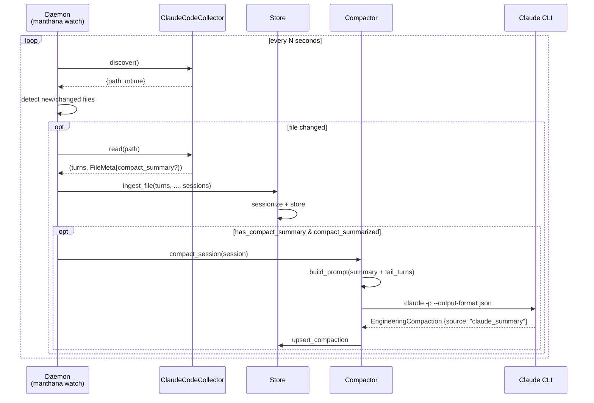
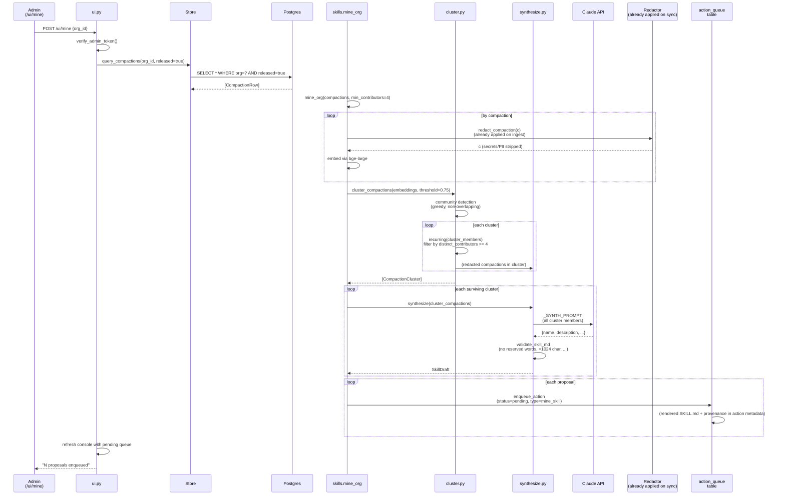
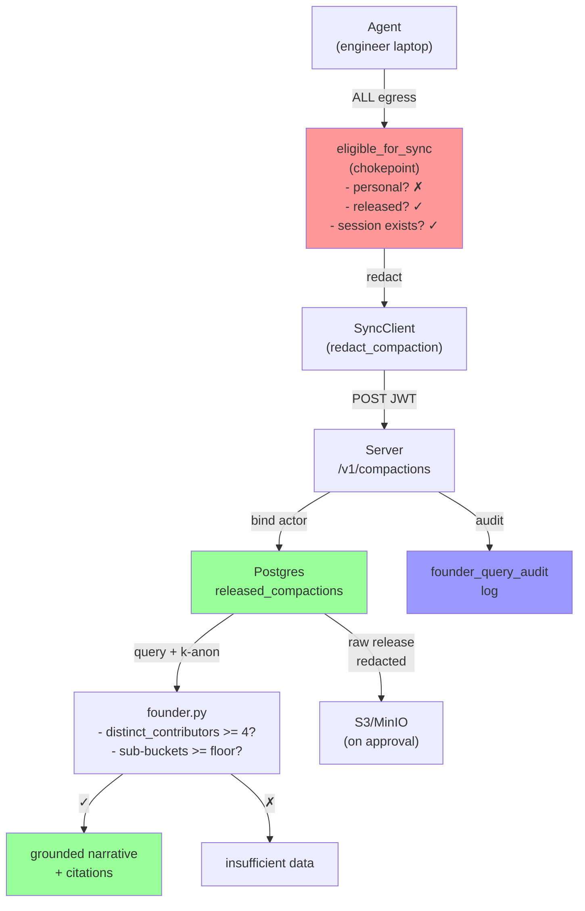

# Manthana Sequence Diagrams

End-to-end flows from capture through founder visibility, with the trust contract and k-anonymity floor enforced at key chokepoints.

---

## 1. Auto-Capture + Cheap Compaction (watch daemon)

Daemon polls `~/.claude/projects`, ingests new transcripts, and auto-compacts summarized sessions (reusing Claude's own summaries).



**Key:** The watcher reuses Claude's own `isCompactSummary` metadata, feeds only the summary + ~40 tail turns to the compactor (massive token savings for 1M-token sessions), and sets `source: "claude_summary"` to flag cheap digest compactions. On ingest, the summary is stripped from the turn stream (no giant duplicate). Cycle ~5-60s, compact flag off by default (cheap; full-session compact is opt-in and token-expensive).

---

## 2. Employee Ask (local self-query, cheapest-first)

Engineer queries their own captured work, grounded in local compactions with optional cost.

```mermaid
sequenceDiagram
    participant E as Engineer<br/>(CLI/Dashboard)
    participant Insights as insights.py
    participant Store
    participant CompDB as Compactions<br/>(local)
    participant LLM as Claude CLI

    E->>Insights: ask(query, source=...)
    Insights->>Store: list_compactions(since=, source=...)
    Store->>CompDB: SELECT * WHERE source IN (...)
    CompDB-->>Store: [BaseCompaction]
    Store-->>Insights: compactions
    
    Insights->>Insights: light NL→filter parse
    Insights->>Insights: grep compaction.{project,tags,...}
    Insights->>Insights: sort by source (claude_summary first)
    
    opt no LLM fallback (no model)
        Insights-->>E: structural rollup only (cost, outcomes, ...)
    else
        Insights->>LLM: ask(query, compaction[0:K])
        LLM-->>Insights: narrative
        Insights->>Insights: cite via _match_citations<br/>(exact-or-unique-prefix)
        Insights->>Store: verify cited ids exist
        
        opt no citations found
            Insights-->>E: "insufficient data" (fallback)
        else
            Insights-->>E: grounded, cited narrative
        end
    end
```

**Key:** Default includes cheap Claude-summary compactions; `source` toggle on CLI/dashboard filters to "full only" / "summaries only". Grounding is **non-optional** — an ungrounded narrative is suppressed. Cost estimate loops over the most recent 300 sessions (cap to prevent N+1 latency cliff). Purely local, no egress.

---

## 3. Release + Sync (redaction on egress, personal-mode gate, k-anon floor on server)

Employee releases a compaction, redacts it, then the daemon syncs via the org server's ingestion API.

```mermaid
sequenceDiagram
    participant E as Engineer<br/>(Dashboard)
    participant Store
    participant Sync as SyncClient
    participant Release as eligible_for_sync<br/>(chokepoint)
    participant Redactor
    participant Server as /v1/compactions
    participant DB as Postgres<br/>(org)

    E->>Store: POST /compaction/{id}/release
    Store->>Store: compaction.released = true
    
    note over Store: (later, daemon auto-sync or manual)
    
    Sync->>Store: list_compactions()
    Sync->>Store: list_sessions()
    Sync->>Release: eligible_for_sync(compactions, sessions)
    
    par release gate
        Release->>Release: session.mode != personal?
        Release->>Release: compaction.released == true?
        Release->>Release: session exists?
    end
    
    Release-->>Sync: [eligible compactions]
    
    loop redact each compaction
        Sync->>Redactor: redact_compaction(c)
        Redactor->>Redactor: scrub free-text fields<br/>(except structural metadata)
        Redactor-->>Sync: redacted copy
    end
    
    Sync->>Server: POST /v1/compactions {compactions[], team_jwt}
    Server->>Server: verify_team_token(jwt) → {actor, org, team}
    Server->>Server: for each: bind compaction.actor = claims.actor
    Server->>Server: verify all released == true
    Server->>DB: atomic batch insert
    DB-->>Server: inserted count
    
    opt count mismatch
        Server-->>Sync: 422 SyncError
    else success
        Server-->>Sync: 200 {ingested: N}
        Sync->>Store: mark_synced(ids)
    end
```

**Key:** `eligible_for_sync` is the **single egress chokepoint** — personal-mode sessions **never** sync (hard invariant), unreleased compactions are blocked, unknown sessions fail closed. Redaction happens **on release** (local store keeps full fidelity). Server **binds actor from JWT** (anti-spoof: one engineer with one token cannot forge other actors). Sync is **atomic at the batch level** — all compactions validated before any row persists; a single bad entry fails the whole batch.

---

## 4. Founder Query (structured-filter-first, k-anon floor, cited narrative)

Founder (admin, via web UI or API) asks a natural-language question. The server parses it, filters compactions, checks k-anonymity, and returns a grounded narrative or "insufficient data."

```mermaid
sequenceDiagram
    participant Founder as Founder<br/>(Admin)
    participant UI as /ui/query<br/>or /v1/founder/query
    participant Parse as founder.py<br/>(parse)
    participant LLM1 as Claude API
    participant SQL as SQL filter
    participant DB as Postgres
    participant KAnon as k-anon floor
    participant Narrative as founder.py<br/>(narrative)
    participant LLM2 as Claude API
    participant Audit as audit log

    Founder->>UI: POST query="what did we ship last week?"
    UI->>UI: verify_admin_token()
    
    UI->>Parse: parse NL → structured FounderFilter
    Parse->>LLM1: _PARSE_PROMPT.format(query)
    LLM1-->>Parse: {team_id?, project?, outcome?, ...}
    Parse->>Parse: validate (or empty filter on error)
    
    Parse->>SQL: build WHERE clauses<br/>(org_scoped, released==true)
    SQL->>DB: SELECT released_compactions WHERE ...
    DB-->>SQL: rows
    
    SQL->>SQL: rollup (session_count, distinct_contributors)
    SQL->>SQL: per-project sub-bucket counts
    SQL->>SQL: per-outcome sub-bucket counts
    
    SQL->>KAnon: distinct_contributors >= K_ANON_FLOOR?
    SQL->>KAnon: each sub-bucket >= floor?
    
    opt below k-anon
        KAnon-->>UI: insufficient_data: true, narrative: "insufficient data"
    else above k-anon
        Narrative->>LLM2: _NARRATIVE_PROMPT<br/>(rollup, compaction excerpts)
        LLM2-->>Narrative: narrative text + [id] citations
        Narrative->>Narrative: _match_citations (exact-or-unique-prefix)<br/>verify each [id] exists
        
        opt no valid citations
            Narrative-->>UI: insufficient_data: true
        else has citations
            Narrative-->>UI: narrative + citations
        end
    end
    
    UI->>Audit: record_founder_query({actor, org, cited_ids, ...})
    UI-->>Founder: FounderResult {filter, rollup, narrative, insufficient_data}
```

**Key:** **Structured-query-first** — NL is parsed to a filter, not directly queried. **K-anonymity floor = 4** enforced globally AND per sub-aggregate (project/outcome buckets); if either drops below floor, the narrative is suppressed. **Grounding is mandatory** — every claim must cite a compaction id by exact match or unique-prefix; an ungrounded narrative is treated as insufficient data. **Graceful degradation** — parse errors or narrative errors log but return "insufficient data" to the client (no 500s). Founder queries are **audited** (who queried what, which compactions were cited).

---

## 5. Org Skill Mining (>=4 contributors, k-anon, enqueue for approval)

Admin triggers cross-engineer skill mining. The server mines the org's released compactions (already redacted on sync), applies the k-anonymity floor, and enqueues proposals for the action queue.



**Key:** Only **released** compactions (already redacted on sync) are mined; no local Redactor needed on the server. **k-anonymity floor = 4 contributors** applied **per cluster** (a cluster with <4 distinct contributors is dropped). **Names are not retained** (`include_contributors=False`). Mined skills are **enqueued in the action queue** with status `pending` — an org action awaits maintainer review before publication. Mining happens **server-side** (no token spend on the agent); only synthesis (if enabled) uses the org's LLM provider.

---

## 6. Optimize (headroom integration, compression tuning)

Engineer sets up and tunes Claude Code's context compression via headroom. Manthana wires the model, reads compression stats, and optionally auto-tunes the CLAUDE.md knowledge file.

```mermaid
sequenceDiagram
    participant E as Engineer<br/>(CLI/Dashboard)
    participant Optimize as optimize.py
    participant Headroom as headroom CLI
    participant Runner as _subprocess_runner<br/>(timeout=180s)
    participant ClaudeCode as Claude Code<br/>(configured)
    participant CLAUDE as CLAUDE.md

    E->>Optimize: manthana optimize setup
    opt headroom not installed
        Optimize-->>E: install hint + link
    else installed
        Optimize->>Runner: headroom init claude
        Runner->>Headroom: init claude
        Headroom-->>Runner: (stdout)
        Optimize-->>E: "✓ claude routing configured"
    end
    
    E->>ClaudeCode: (configure ANTHROPIC_BASE_URL)
    ClaudeCode->>Headroom: proxy: requests go through headroom
    
    E->>Optimize: manthana optimize status
    Optimize->>Runner: headroom perf --format json (timeout=180s)
    Runner->>Headroom: perf
    Headroom-->>Runner: {tokens_in, tokens_out, ratio, ...}
    Runner->>Runner: bounds check output (_MAX_OUT)<br/>memory-DoS guard
    Optimize-->>E: compression stats + savings
    
    E->>Optimize: manthana optimize tune
    opt non-blocking daemon thread
        Optimize->>Runner: headroom learn --apply<br/>reads insights from Store
        Runner->>Optimize: reads local Ask insights
        Runner->>CLAUDE: rewrites with new reusable patterns
        Runner-->>E: (logs result, non-blocking)
    end
    
    Optimize-->>E: CLAUDE.md updated (or error logged)
```

**Key:** Headroom is an **optional extra** (`manthana[optimize]`); absence degrades gracefully. Subprocess calls have a **180-second timeout** (prevents hangs). Setup is **one-click** (`init claude` on login). Tuning reads **local insights** (from the engineer's own Ask/compaction data) and applies them to CLAUDE.md. All calls are **injection-safe** (argv from constants, no shell, no string interpolation).

---

## 7. High-Level Trust Architecture (sync chokepoint + audit)

The spine: one gate, redaction on release, k-anon on the server, audit logging.



**Key flows:**
1. **Egress gate** (`eligible_for_sync`): personal-mode hard-blocked, unreleased hard-blocked, fail-closed on unknown session.
2. **Redaction on release**: secrets/PII scrubbed before egress; local store keeps full fidelity.
3. **Server-side actor binding**: JWT is the source of truth; payload actor is overwritten.
4. **K-anonymity on server**: global floor (4) + per-bucket floor; sub-floor cohorts suppressed.
5. **Grounding mandatory**: founder narrative must cite real compaction ids; ungrounded → "insufficient data".
6. **Audit trail**: every founder query logged (who, when, which compactions).

---

## Cross-References

- **spec/manthana-architecture.md** — full implementation details (phases, real code paths, adversarial review fixes)
- **spec/manthana-decisions.md** — locked decisions (trust contract, k-anon floor = 4, capture surfaces, licensing)
- **docs/deploy.md** — running the server + Postgres/MinIO setup
- **docs/onboarding.md** — employee one-time setup + daily use (dashboard only)

---

## Glossary

- **`eligible_for_sync`** — `/Users/suraj/Desktop/project/agent/src/manthana/agent/sync.py` — single egress chokepoint; personal-mode excluded, release-gated, fail-closed.
- **`SyncClient`** — `/Users/suraj/Desktop/project/agent/src/manthana/agent/sync_client.py` — redacts + POSTs compactions to server; idempotent via sync-state table.
- **`founder.py`** — `/Users/suraj/Desktop/project/server/src/manthana/server/founder.py` — NL→filter→SQL→k-anon→grounded narrative.
- **`SkillMiner`** — `/Users/suraj/Desktop/project/skills/src/manthana/skills/miner.py` — embed/cluster/synthesize; k-anon floor = 4 for org mining; names dropped.
- **`watch`** — `/Users/suraj/Desktop/project/agent/src/manthana/agent/watcher.py` — daemon: incremental capture + auto-sync.
- **Compactor** — `/Users/suraj/Desktop/project/agent/src/manthana/agent/compact.py` — session → LLM (Claude/Codex CLI) → `EngineeringCompaction`; `source: "full" | "claude_summary"`.
- **`insights.ask`** — `/Users/suraj/Desktop/project/agent/src/manthana/agent/insights.py` — local NL→compactions→narrative; no egress; grounded+cited.
- **Dashboard** — `/Users/suraj/Desktop/project/agent/src/manthana/agent/dashboard/app.py` — FastAPI+HTMX; Sessions, Compactions (inbox), Skills, Ask, Optimize, Cost, Actions pages; all actions via POST.
